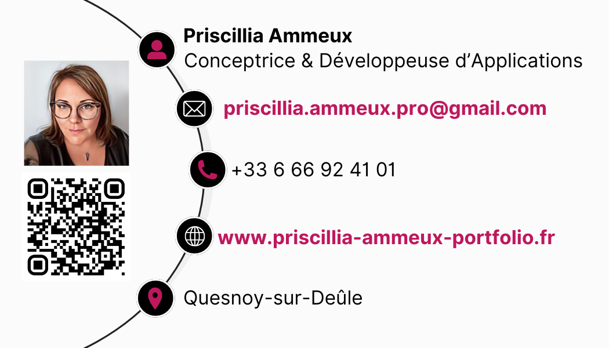

## About me

I am a software developer and designer. I have a passion for creating software and web applications. I have a strong background in Java, SpringBoot, Nodejs, Nextjs, React, Flutter, PostgreSQL, MySQL, and Git. I have a degree in Application Designer and Developer and a degree in Web and Mobile Web Developer. I am available to advise and guide customers in their choice.

## My skills

I can specify, design and develop software or web applications. Here is a list of my skills:

### Backend

- Nodejs
- Java
- SpringBoot

### Frontend

- Nextjs
- Reactjs
- Vuejs
- Flutter

### Databases

- PostgreSQL
- MySQL

### Project management

- Git

I can also advise and guide customers in their choice.

- RNCP “Application Designer and Developer” - level 6 - Acquired in February 2024
- RNCP "Developer web and web mobile” - level 5 - Acquired in October 2023

## Contact me

[See Portfolio](https://www.priscillia-ammeux-portfolio.fr)

